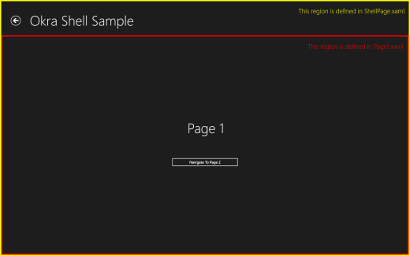

Shell based navigation
======================

By default the Okra App Framework will display pages full screen, with each navigation replacing the previous
page with the next. There are some occasions however where it makes sense to have an application shell that
takes up the full screen, with the page navigation occurring in a region within this.

A typical example would consist of a fixed region dedicated to navigation at the top of the screen, with the
page content filling below. The end result looks like,

	<b>Note:</b> 
	<a href="https://github.com/OkraFramework/Okra-Samples/tree/master/OkraShellSample">
		Source code for an 'Okra Shell Sample' application is available on GitHub
	</a>

Creating an application shell
-----------------------------

The key to creating an application shell in Cocoon is the **INavigationTarget** interface. This has only a
single method named NavigateTo(...). When implemented by an application, any calls to the navigation framework
will result in a call to this method with the page to display. The framework itself will handle the creation
and wiring up of views and view-models, the navigation stack, persistence and other aspects of navigation.

In our example application we will use the MVVM pattern to define our application shell, hence we have a ShellViewModel,


[Export(typeof(INavigationTarget))]
[Shared]
public class ShellPageViewModel : NotifyPropertyChangedBase, INavigationTarget
{
    // *** Fields ***

    private INavigationBase navigationManager;
    private ICommand goBackCommand;

    private object content;
    private ShellPage shellPage;

    // *** Properties ***

    public object Content
    {
        get { return content; }
        set { SetProperty(ref content, value); }
    }

    public ICommand GoBackCommand
    {
        get { return goBackCommand; }
        set { SetProperty(ref goBackCommand, value); }
    }

    // *** INavigationTarget Methods ***

    public void NavigateTo(object page, INavigationBase navigationManager)
    {
        // If this is the first navigation then create the shell view and bind to this view model

        if (shellPage == null)
        {
            shellPage = new ShellPage();
            shellPage.DataContext = this;
        }

        // Set the content for the shell to the specified page

        this.Content = page;

        // Set the shell view as the window content

        Window.Current.Content = shellPage;

        // Update the navigation manager if changed

        if (this.navigationManager != navigationManager)
        {
            this.navigationManager = navigationManager;
            this.GoBackCommand = navigationManager.GetGoBackCommand();
        }
    }
}


The ShellViewModel exposes a 'Content' property that will contain the page to display and will
be bound to in the view. In our NavigateTo(...) method we firstly create the associated view if
required. We then set the 'Content' property to the supplied page and this ensure that the view
is displayed in the window. Finally we mark the class as a shared export of **INavigationTarget**
using the MEF attributes. Note that since we will never be navigating explicitly to the shell
then we do not need to decorate this with a ViewModelExport attribute.

The ShellPage.xaml file contains the view for the application shell. This simply contains the
required elements for the upper portion of the screen, with a ContentControl bound to the view
models 'Content' property. It is within this ContentControl that the pages will be displayed.
The key elements are shown below,


<Grid Background="{ThemeResource ApplicationPageBackgroundThemeBrush}">
    <Grid.RowDefinitions>
        <RowDefinition Height="140"/>
        <RowDefinition Height="*"/>
    </Grid.RowDefinitions>

    <!-- Back button and page title -->
    <Grid>
        <Grid.ColumnDefinitions>
            <ColumnDefinition Width="120"/>
            <ColumnDefinition Width="*"/>
        </Grid.ColumnDefinitions>
        <Button Margin="39,59,39,0" Command="{Binding GoBackCommand}"
                        Style="{StaticResource NavigationBackButtonNormalStyle}"
                        VerticalAlignment="Top"
                        AutomationProperties.Name="Back"
                        AutomationProperties.AutomationId="BackButton"
                        AutomationProperties.ItemType="Navigation Button"/>
        <TextBlock Text="{StaticResource AppName}" Grid.Column="1"
                        Style="{StaticResource HeaderTextBlockStyle}" 
                        IsHitTestVisible="false" TextWrapping="NoWrap" VerticalAlignment="Bottom"
                        Margin="0,0,30,40"/>
    </Grid>
    <ContentControl Content="{Binding Content}" Grid.Row="1"
                        HorizontalContentAlignment="Stretch" VerticalContentAlignment="Stretch"/>
</Grid>


When the application is run the NavigationManager will automatically locate the INavigationTarget
through the MEF export and direct all navigation through the newly defined shell.