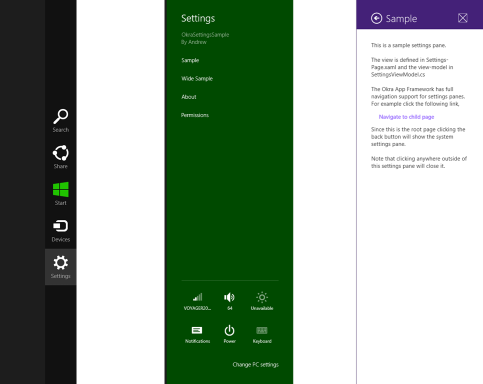

Adding a settings flyout
======================

In Windows 8.1, application settings are available from any page of a running application by using the
settings charm. This brings up a system-provided list of the available settings entry points, with application
specific settings at the top (followed by the Windows provided "Permissions" and "Rate and review" items).
If the user selects one of these application specified entry points it is the responsibility of the
running application to provide the resulting settings UI.

The Okra App Framework makes it simple to add custom settings flyouts, following the same MVVM pattern as any
other page. The framework takes care of displaying the correct UI and providing a
dedicated navigation stack.

	<b>Note:</b> 
	<a href="https://github.com/OkraFramework/Okra-Samples/tree/master/OkraSettingsSample">
		Source code for an 'Okra Settings Sample' application is available on GitHub
	</a>

Creating a settings flyout
------------------------

The [Okra App Framework Visual Studio extension](getting_started_downloading.html) provides a dedicated
template for creating settings flyouts. From the Visual Studio **Add New Item** dialog select the
**Settings Flyout (MVVM)** item. This will create a **SettingsFlyout** derived XAML file along
with an associated view-model.

Alternatively you can annotate existing settings flyouts using the usual **PageExportAttribute**
and **ViewModelExportAttribute** annotations.


[PageExport("MySettings")]
public sealed partial class MySettingsFlyout : SettingsFlyout
{
    ...
}

[ViewModelExport("MySettings")]
public class MySettingsViewModel : MyViewModelBase
{
    ...
}


Registering settings flyouts with Windows
---------------------------------------

Once you have created your settings flyouts, they must be registered with Windows to be displayed in the system
settings pane. You can register application settings in your **AppBootstrapper.cs** file by following a few
simple steps.

1. Import an **Okra.Navigation.ISettingsPaneManager**
2. Override the **SetupServices()** method and attach a handler to the **SettingsPane.GetForCurrentView().CommandsRequested** event
3. In the event handler add each settings item to the **args.Request.ApplicationCommands** collection in the order you wish them to appear


public class AppBootstrapper : OkraBootstrapper
{
    // *** Imported Properties ***

    [Import]
    public ISettingsPaneManager SettingsPaneManager { get; set; }

    // *** Overriden Base Methods ***

    protected override void SetupServices()
    {
        // Register with Windows to display items in the settings pane

        SettingsPane.GetForCurrentView().CommandsRequested += SettingsPane_CommandsRequested;
    }

    // *** Private Methods ***

    void SettingsPane_CommandsRequested(SettingsPane sender, SettingsPaneCommandsRequestedEventArgs args)
    {
        // The settings names should be localised so create a ResourceLoader to gather these from

        ResourceLoader resourceLoader = new ResourceLoader();

        // Add each settings item in the order you wish them to appear

        args.Request.ApplicationCommands.Add(SettingsPaneManager.GetNavigateToSettingsCommand(resourceLoader.GetString("SampleCommandLabel"), "Settings_Sample"));
        args.Request.ApplicationCommands.Add(SettingsPaneManager.GetNavigateToSettingsCommand(resourceLoader.GetString("WideCommandLabel"), "Settings_Wide"));
        args.Request.ApplicationCommands.Add(SettingsPaneManager.GetNavigateToSettingsCommand(resourceLoader.GetString("AboutCommandLabel"), "Settings_About"));
    }
}


Application commands are provided by an **ISettingsPaneManager.GetNavigateToSettingsCommand(...)** helper method. This takes
two arguments, the first being the name to display in the settings UI, and the second being the name of the page used for the
**PageExportAttribute** and **ViewModelExportAttribute** annotations. It is good practice to load the display names from a
resource file to allow localisation.