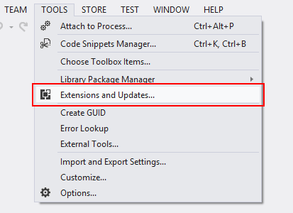
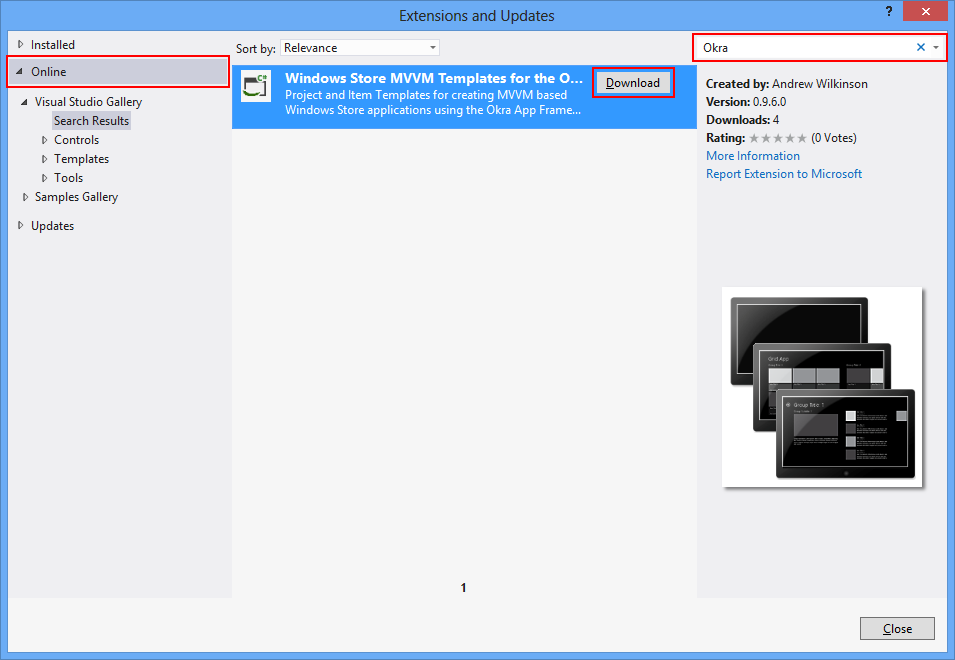
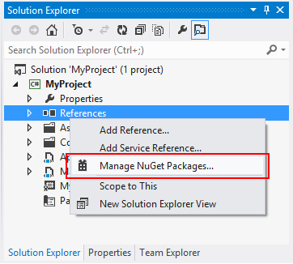
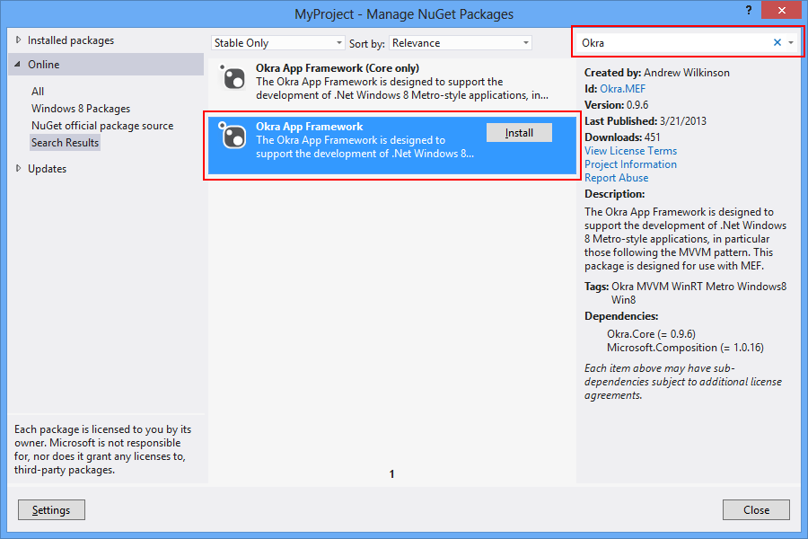

Downloading the Okra App Framework
==================================

There are a number of options for downloading the Okra App Framework,

* [Using the Visual Studio Extensions](#bookmark-vsextenstions)
  - This is the recommended approach for creating new applications with the Okra App Framework. It also provides a number of
    item templates that will be of use to those upgrading existing projects to the Okra App Framework.
* Via NuGet
  - This is the recommended approach for adding the Okra Framework to existing projects.
* Downloading the source code
  - For advanced users who wish to view or modify the framework itself.

Downloading the Visual Studio Extensions {: #bookmark-vsextenstions}
----------------------------------------

The Okra App Framework is available via a Visual Studio extension containing a number of templates based on the standard Windows Store items included with Visual Studio,
but rewritten to take full advantage of the MVVM pattern.

1. From Visual Studio open the extension manager by selecting the **Tools** menu and **Extensions and Updates...**

	

2. Select **Online** from the panel on the left hand side
3. Type "Okra" into the search box in the top right of the resulting window and press return
4. Select **Windows Store MVVM Templates for the Okra App Framework** from the list of search results
5. Click **Download**

	

Obtaining the Okra App Framework via NuGet
------------------------------------------

NuGet is a Visual Studio extension that makes it easy to install and update third-party libraries and tools in Visual Studio. The NuGet package manager is included in Visual
Studio 2012 and is the easiest way to add the Okra App Framework to existing projects. You can still install the Visual Studio Extension described above to take advantage of
the item templates.

1. From the Visual Studio Solution Explorer window right click on the **References** folder of your project and select **Manage NuGet Packages...**

    

2. Type "Okra" into the search box in the top right of the resulting window and press return
3. Select **Okra App Framework** from the list of search results (NB: Don't use the **(Core only)** package as this does not include the MEF magic!)
4. Click **Install**

    

Downloading the Okra App Framework source code
----------------------------------------------

If you wish to work directly with the Okra App Framework source code,

* The latest official release is available in the [Okra.Core releases section](https://github.com/OkraFramework/Okra.Core/releases). The complete source code will be available to download as a zip file.
* The very latest source code is available from [Okra.Core source control](https://github.com/OkraFramework/Okra.Core). Note that this will not be as stable as the official releases, and may change significantly before release.
